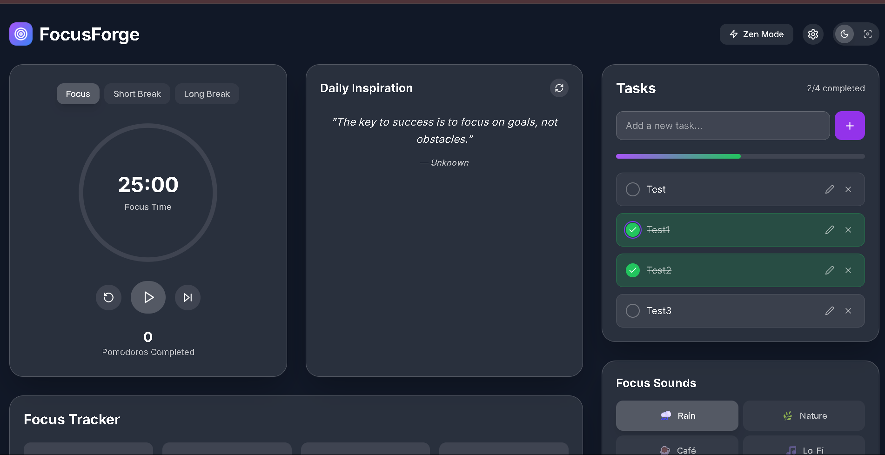

#  FocusForge

**Distraction-free, frontend-only ambient sound app for deep focus.**

FocusForge is a beautifully crafted React-based productivity tool that helps users stay in the zone with soothing background sounds like rain, nature, café ambience, and lo-fi beats. Built using cutting-edge frontend technologies with no backend or API dependency.

---

##  Preview

  

---

##  Features
 Real ambient sound playback (Rain, Nature, Café, Lo-Fi)  
 Sleek UI with **Framer Motion animations**  
 Responsive layout with **Tailwind CSS**  
 Theme toggling between **Dark Mode** and **Focus Mode**  
 Custom audio volume and mute controls  
 Animated Now Playing visual indicator  
 Works offline using static audio files

---

##  Tech Stack

- **React** (with Hooks and Functional Components)
- **Tailwind CSS** (v3+)
- **Framer Motion** – for smooth animations
- **Lucide Icons** – modern icon set
- **HTML5 `<audio>`** – native sound handling

---

##  Setup Instructions

1. **Clone the repository**

```bash
git clone https://github.com/rajanarahul93/FocusForge.git
cd FocusForge
````

2. **Install dependencies**

```bash
npm install
# or
yarn install
```

3. **Start the development server**

```bash
npm run dev
# or
yarn dev
```

4. **Build for production**

```bash
npm run build
# or
yarn build
```

---

##  Add Your Own Sounds

You can replace or add more `.mp3` files in:

```
/public/sounds/
```

Make sure the filename matches the `id` used in the `tracks` array in `MusicPlayer.tsx`.

---

##  Contributing

Pull requests are welcome! For major changes, please open an issue first to discuss what you would like to change.

##  Acknowledgements

* [Lucide Icons](https://lucide.dev/)
* [Framer Motion](https://www.framer.com/motion/)
* [Tailwind CSS](https://tailwindcss.com/)

---

 
